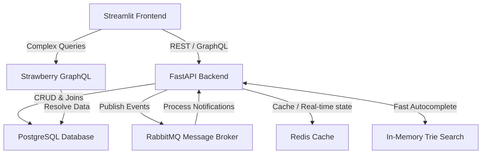
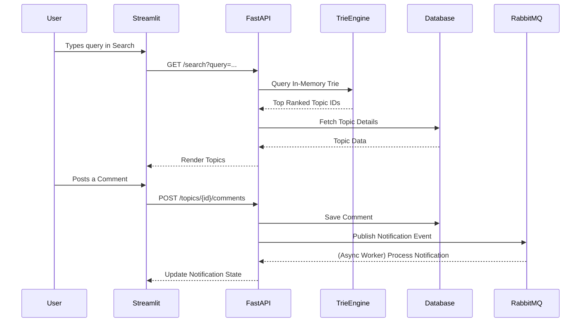

<h1 align="center">💬 Real-Time Discussion Forum Platform</h1>

<p align="center">
  <b>A highly responsive, full-stack discussion forum featuring real-time notifications, lightning-fast Trie-based search, GraphQL support, and a scalable microservices-like architecture.</b>
</p>

<p align="center">
  
  
  
  
  
  
  
  
</p>

---

## 📋 Table of Contents

- [Problem Statement](#-problem-statement)
- [What We Implemented](#-what-we-implemented)
- [Tech Stack & Why](#-tech-stack--why)
- [System Architecture](#-system-architecture)
- [Application Flow](#-application-flow)
- [Folder Structure](#-folder-structure)
- [Getting Started](#-getting-started)
- [API & Features](#-api--features)
- [Future Enhancements](#-future-enhancements)

---

## 🎯 Problem Statement

Traditional discussion forums often suffer from sluggish search experiences, lack of real-time engagement, and rigid API structures that make frontend iteration difficult. Users expect instant feedback, real-time notifications when their posts are interacted with, and lightning-fast search capabilities to find relevant topics instantly.

### 🔑 Core Question

> *How can we build a scalable, real-time discussion platform that offers instantaneous search across thousands of topics, delivers real-time notifications efficiently, and provides flexible data querying for diverse client needs?*

---

## 🚀 What We Implemented

### Full-Stack Real-Time Forum

We engineered a robust platform that combines a high-performance Python backend with an interactive Streamlit frontend. The system is divided into key functional components:

#### 1. Lightning-Fast Search Engine
- **Custom Trie Data Structure**: Instead of relying solely on database `LIKE` queries, we implemented an in-memory **Trie** (`TopicTrie`) and `TopicRanker` to provide ultra-fast, autocomplete-style search for topics. 

#### 2. Real-Time Notification System
- **Asynchronous Messaging**: Utilizing **RabbitMQ** and **Redis**, the system decouples notification generation from the main request cycle, allowing users to receive real-time updates when someone comments on their topics.

#### 3. Flexible API Surface
- **REST + GraphQL**: The backend serves standard RESTful endpoints for CRUD operations and authentication, while also exposing a **GraphQL** endpoint (via Strawberry) for clients that require deeply nested or specifically tailored data fetching.

#### 4. Interactive UI Dashboard
- **Streamlit Frontend**: A clean, state-managed Streamlit application that handles user authentication (JWT/Firebase style), topic browsing, comment threads, trending topics, and profile management.

---

## 🛠️ Tech Stack & Why

| Technology | Role | Why This Choice |
|---|---|---|
| **FastAPI** | Backend Framework | Async-first, high throughput, and automatic OpenAPI documentation. |
| **Streamlit** | Frontend UI | Rapid development of stateful, data-driven user interfaces in pure Python. |
| **PostgreSQL** | Primary Database | Reliable, ACID-compliant storage for users, topics, and comments. |
| **Redis** | Caching & State | Fast in-memory data store for caching and intermediate state management. |
| **RabbitMQ** | Message Broker | Handles asynchronous tasks and routes real-time notifications efficiently. |
| **Strawberry GraphQL** | GraphQL Server | Provides a strongly-typed, Pythonic way to build flexible GraphQL APIs alongside REST. |
| **SQLAlchemy + Alembic** | ORM & Migrations | Robust database interactions and version-controlled schema evolution. |
| **Docker Compose** | Orchestration | Simplifies spinning up the entire stack (App, DB, Cache, Broker) with one command. |

---

## 🏛️ System Architecture



---

## 🔄 Application Flow

### Topic Search & Interaction Lifecycle



---

## 📁 Folder Structure

```text
rt-discussion-forum/
│
├── 🐳 docker/                       # Docker configuration
│   ├── Dockerfile
│   └── docker-compose.yml           # Orchestrates API, Postgres, Redis, RabbitMQ
│
├── 📄 requirements.txt              # Python dependencies
├── 📄 alembic.ini                   # Database migration configuration
├── 📄 trie_data.pkl                 # Serialized Trie state for fast startup
│
├── 📂 alembic/                      # Database migrations
│
├── 📂 frontend/                     # ⭐ Streamlit UI Dashboard
│   └── app.py                       # Main frontend application with session state
│
└── 📂 backend/                      # ⭐ FastAPI Backend Package
    ├── main.py                      # Application entry point, lifespan, & routing
    ├── 📂 api/                      # REST API Route handlers (CRUD, Auth)
    ├── 📂 auth/                     # Authentication utilities
    ├── 📂 core/                     # Configs
    ├── 📂 db/                       # SQLAlchemy models, sessions, CRUD ops
    ├── 📂 graphql/                  # Strawberry GraphQL schema & resolvers
    └── 📂 services/                 # Business logic
        ├── notifications.py         # Real-time notification logic
        └── search.py                # Trie and TopicRanker implementation
```

---

## 🚀 Getting Started

### Prerequisites

| Tool | Version |
|---|---|
| [Docker](https://docs.docker.com/get-docker/) | 20.10+ |
| [Docker Compose](https://docs.docker.com/compose/) | 2.0+ |

### Installation & Setup (Docker Recommended)

```bash
# 1. Clone the repository
git clone https://github.com/rishabh-singh04/rt-discussion-forum.git
cd rt-discussion-forum

# 2. Build and start all services using Docker Compose
cd docker
docker-compose up --build -d

# 3. Access the application
# Backend REST API Docs: http://localhost:8000/docs
# GraphQL Playground: http://localhost:8000/graphql
# Frontend Dashboard: http://localhost:8501 (Run via Streamlit)
```

### Running Frontend Locally (Without Docker UI)

If the frontend isn't explicitly defined in `docker-compose.yml`, run it locally:

```bash
# In a new terminal, from the project root
pip install streamlit requests
cd frontend
streamlit run app.py
```

### Service Ports

| Service | Port | Purpose |
|---|---|---|
| **FastAPI Backend** | `8000` | REST API, GraphQL, and Business Logic |
| **Streamlit UI** | `8501` | User Interface |
| **PostgreSQL** | `5432` | Relational Data Storage |
| **Redis** | `6379` | Caching & State Management |
| **RabbitMQ** | `5672` | Message Queuing (`15672` for management UI) |

---

## 🌐 API & Features

### REST Endpoints
- **Authentication**: JWT/Firebase-based login (`/auth/get-firebase-token`), Registration (`/auth/signup`), User lookup (`/auth/me`).
- **Topics**: Create (`POST /topics`), Read all/Trending (`GET /topics`), Delete (`DELETE /topics/{id}`).
- **Comments**: Post comment (`POST /topics/{id}/comments`), Read comments (`GET /comments/{id}`), Delete comment.
- **Search**: Trie-powered fast search (`GET /search?query={query}`).
- **Notifications**: Fetch user notifications (`GET /notifications`).

### GraphQL
Access the interactive GraphiQL playground at `http://localhost:8000/graphql` to perform complex, nested queries for users, topics, and related comments in a single request.

---

## 🔮 Future Enhancements

- [ ] 🕸️ **WebSocket Integration** — Push notifications instantly to the Streamlit UI via WebSockets instead of polling.
- [ ] 🧠 **AI Moderation** — Auto-flag toxic topics and comments using local LLMs or NLP models.
- [ ] 📈 **Analytics Dashboard** — Admin view for topic popularity, user engagement, and system health metrics.
- [ ] 🧪 **Test Coverage** — Add Pytest suite for core logic (Trie, API routing, GraphQL resolvers).

---

<p align="center">
  <b>Built with ❤️ using FastAPI, Streamlit, and GraphQL</b>
</p>
